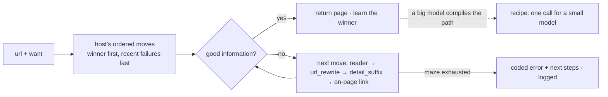

# Scout MCP

Scout is an MCP server for web crawling that improves with use. A capable model like Claude works a site out once.
Scout compiles what it learned into a **recipe** that a 4B model can run with one instruction.

```
/scout https://mikrotik.com/product/RB433AH price|cpu
```

Claude reaches the page, maps the site and finds the traps. It then hands back a one-line card that Qwen3.5-4B runs
correctly from then on:

```
Call the tool run with recipe="mikrotik.com/specs" and input="hAP ax2". Reply with the RESULT line only.

RESULT: ok | mikrotik.com/specs | hAP ax2 | url=https://mikrotik.com/product/hap_ax2; title=MikroTik · hAP ax²; price=$99.00; cpu=IPQ-6010; ram=1 GB; max_power=27 W
```

## Install

**Claude Code** (installs the MCP server and the `/scout` skill):

```
/plugin marketplace add sireggserroneous/scout-mcp
/plugin install scout@scout-mcp
```

**Any MCP client.** Install [uv](https://docs.astral.sh/uv/), then add this to the client's MCP config:

```json
{ "mcpServers": { "scout": { "command": "uvx",
  "args": ["--from", "git+https://github.com/sireggserroneous/scout-mcp", "scout-mcp"] } } }
```

**Pages built by JavaScript** need a headless browser. Add `"--with", "playwright"` to the uvx args, then run
`uvx playwright install chromium` once. If you already run Firecrawl or crawl4ai, set `FIRECRAWL_URL` or
`CRAWL4AI_URL` and Scout uses it as one more reader.

## From a maze to one line

Getting MikroTik specs looks like a one-step job. Here is what Claude actually ran into on the way:

| Try | Result |
|---|---|
| guess `mikrotik.com/product/{model}` | `RB433AH` works. `hAP ac3` is a 404: that page lives at `hap_ac3`. |
| lowercase it, turn spaces into `_` | Now `RB433AH` is a 404: that one really is uppercase. |
| also turn `+` into `plus` | `CRS354-48G-4S+2Q+RM` works (`crs354_48g_4splus2qplusrm`)… |
| | …but `RB5009UG+S+IN` lives at `rb5009ug_s_in`. Same character, opposite rule. |
| **look the url up in the sitemap, comparing both sides with `plus` and punctuation removed** | **all four styles work** |

Then the data: 4 fields, each a label on one line and its value on a later line, on a page that also has a 40-row
throughput table, a documents list and a retailer map.

Written out as instructions, that is a 7-step program with a string-normalisation rule, a loop over 566 urls,
a branch for "not found", and four lookups in a 7,000-character page. That is too much for a 4B model. So it is
never handed to one. Claude compiles it instead:

```json
{"name": "mikrotik.com/specs", "input_name": "model",
 "examples": ["RB433AH", "hAP ac3", "CRS354-48G-4S+2Q+RM", "RB5009UG+S+IN", "CCR2004-1G-12S+2XS"],
 "steps": [
  {"map": "https://mikrotik.com", "filter": "/product/", "same": [["plus", ""], ["[^a-z0-9]", ""]]},
  {"reach": "{url}", "want": "Specification"},
  {"extract": {"price":     "^\\s*-\\s*Suggested price\\s*\\n\\s*(\\S.*)$",
               "cpu":       "^\\s*-\\s*CPU\\s*\\n\\s*(\\S.*)$",
               "ram":       "^\\s*-\\s*Size of RAM\\s*\\n\\s*(\\S.*)$",
               "max_power": "^\\s*-\\s*Max power consumption\\s*\\n\\s*(\\S.*)$"}}]}
```

`compile` runs the recipe on every example and **saves it only if all of them pass**. The two wrong guesses above
were caught this way: each one passed on some examples and failed on others. Once saved, every branch lives in code.
The small model gets one card and one tool, and its whole job is a single call:

| | the small model gets | the small model must |
|---|---|---|
| without a recipe | 7 numbered steps, `site_map` and `reach` | normalise strings, scan 566 urls, branch, read a 7k-char page, format a line |
| with a recipe | 1 line, the `run` tool | make one call, copy one line |

**Measured on Qwen3.5-4B** (Q4_K_M, llama.cpp on a laptop iGPU), on 5 MikroTik models, as an A/B:

| | exact answer | tool calls | wall time (median) |
|---|---|---|---|
| **A**: the 7 steps as instructions, `site_map` + `reach` | 4 / 5 | 2–4 per model, 15 in all (5 of them wrong turns) | 389–671 s (414 s) |
| **B**: the card, `run` | **5 / 5** | **1 per model** | **22–195 s (88 s)** |

In arm A, Qwen filtered the sitemap with the raw model name, built a url with a space in it, and once dropped the `$`
from a price. It reached the right page in the end, but it took 3 to 11 minutes each time, mostly spent reading 566
urls and a 7,000-character page. In arm B the model never sees any of that. One arm-A run did catch a bug in the
recipe: the RAM regex had matched a sentence in the product description, not the spec list. The fix (anchoring each
field to its list item) went in, the recipe was recompiled with that model as a fifth example, and the arm-B run was
repeated on the fixed recipe. Both arms used the same model and the same Scout. Harness: `bench/qwen_ab.py`.

If a page changes, `run` fails loudly with a code: `NO_MATCH at step 1`, `EXTRACT_MISS at step 3`. The recipe's
score drops, and `recipes()` marks it `last run failed … recompile`. The next big-model session fixes the recipe. The
small model's card stays the same.

The CLI form fits a small model with a shell. It prints one line and exits 1 on failure:

```
$ scout-mcp run mikrotik.com/specs "CCR2004-16G-2S+"
RESULT: ok | mikrotik.com/specs | CCR2004-16G-2S+ | url=https://mikrotik.com/product/ccr2004_16g_2splus; ... price=$465.00; cpu=AL32400; ram=4 GB; max_power=48 W
$ scout-mcp run mikrotik.com/specs "nope 9"
RESULT: fail | mikrotik.com/specs | nope 9 | NO_MATCH at step 1
```

### Recipe steps

| Step | Does |
|---|---|
| `{"input": [[regex, repl], ...], "lower": true}` | rewrites the input (slug rules) |
| `{"map": url, "filter": regex, "same": [[regex, repl], ...]}` | the site's own urls. `same` keeps the url whose last segment equals the input after both are rewritten. Last step: returns the list. Otherwise: the first url becomes `{url}`. |
| `{"reach": "https://…/{input}" \| "{url}", "want": regex}` | reads a page with the full reader ladder (below) |
| `{"find": regex}` | the first link on the page whose url or text matches becomes `{url}` |
| `{"extract": {"field": regex}}` | group 1 of each regex. Every field must be found. |

## How Scout learns: a maze, a Markov chain, and rewrite rules

Every way to reach a page is a **move**:
- the readers: `direct`, `firecrawl`, `crawl4ai`, `browser`
- `url_rewrite`: a regex on the full url
- `listing_path`: where a site keeps its index of things, such as `/products`, `/catalog` or `/docs`
- `detail_suffix`: where the details live, such as `/specifications`

The idea comes from Markov chains and MarkovJunior-style rewrite rules. Each move takes Scout from one state to the
next. The goal state is **good information**: real content (not a wall, a login page or an error page) that carries
what you asked for.



- **Each host keeps its readers in order.** The reader that last worked goes first, and one that failed goes to the
  back for six hours. When excalidraw.com gives a plain fetch an empty JavaScript shell, Scout falls back to the
  browser. On the next visit it starts with the browser.
- **The register stores moves as data.** Each move has a scope (`*`, a domain or a host regex) and a Laplace score
  `(wins + 1) / (tries + 2)`. A move nobody has tried scores 0.5. A move that loses its first five tries is retired.
  Agents propose moves with `moves(action='propose', …)`, and real traffic decides which ones stay.
- **Recipes are the compiled layer on top.** Every run scores a recipe, the same way moves are scored.

Point `SCOUT_DB` at a shared path and a whole team, people and agents alike, learns from each other's runs.

## Errors that say what to do next

When Scout fails, it returns an error `code`, a `message`, and `next_steps` written as concrete tool calls, plus the
`tried` trail it took through the maze. Any capable model can pick up from there.

| Code | Next steps point to |
|---|---|
| `NOT_FOUND` | `site_map` instead of guessing paths |
| `WANT_MISS` | loosening `want`, a `detail_suffix` move, `site_map` |
| `JS_SHELL` / `THIN_CONTENT` | adding a rendering reader, the site's JSON endpoints, a print view |
| `REFUSED` / `CHALLENGE_WALL` / `LOGIN_REQUIRED` | the site's API, an archive copy as a `url_rewrite` move, the same document elsewhere |
| `ROBOTS_DISALLOWED` / `RATE_LIMITED` | an official feed, waiting for `Retry-After` |
| `TLS_ERROR` / `NETWORK` / `SERVER_ERROR` | the cause, retrying later |
| `NO_URLS` / `NO_LISTING` / `NO_MATCH` / `EXTRACT_MISS` / `TEST_FAILED` | what to recompile or propose |

## Tools

| Tool | For | Does |
|---|---|---|
| `scout(url, want?)` | big model | reaches the page, maps url patterns, finds the listing, reports what was learned |
| `reach(url, want?, full?)` | big model | reads one page through the learned ladder |
| `site_map(url, filter?)` | big model | the site's own urls and their patterns |
| `compile(name, steps, examples, …)` | big model | tests a recipe and saves it, returns the small-model card |
| `moves(action, …)` | big model | lists, proposes or retires moves |
| `memory(host?)` | big model | reader order, routes, moves and recent failures for a host |
| `recipes(host?)` | both | compiled recipes with scores, status and cards |
| `run(recipe, input?)` | **small model** | runs a recipe, returns one RESULT line |

Give the small model only `run`, or the CLI. One tool means it has nothing to choose between.

## Configuration

| Variable | Default |
|---|---|
| `SCOUT_DB` | `~/.local/share/scout-mcp/scout.db` |
| `SCOUT_USER_AGENT` | `ScoutMCP/<version> (+https://github.com/sireggserroneous/scout-mcp)` |
| `SCOUT_MIN_INTERVAL` | `1.0` seconds between requests to one host |
| `FIRECRAWL_URL`, `FIRECRAWL_API_KEY`, `CRAWL4AI_URL`, `CRAWL4AI_TOKEN` | unset |

## Develop

```
uv venv && uv pip install -e . playwright
python -m scout_mcp.scout      # self-checks, no network
```

There are two modules. `scout_mcp/scout.py` is the engine, and `scout_mcp/server.py` holds the MCP tools and the CLI.
Seed moves and example recipes are in `scout_mcp/recipes.json`. MIT licensed.
