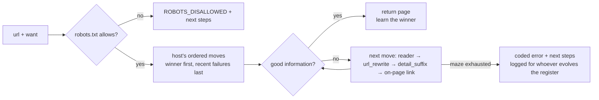

# Scout MCP

Scout is an MCP server for building a web crawler that gets better with use. Its job is to get good information
from a website.

Scout is an **HonestBot**. It scouts the open web without tricks and never pretends to be a person:

- Every request carries one plain user agent: `ScoutMCP/0.1.0 (+https://github.com/sireggserroneous/scout-mcp)`.
  Scout refuses to start if you set a user agent that looks like a browser.
- It obeys `robots.txt` and `Crawl-delay`, and sends at most one request per second to a host.
- It does not solve CAPTCHAs, rotate identities, use proxies, or log in for you.

If a site says no, Scout reports that and suggests an honest next step. It does not try to get around the refusal.

## Install

**Claude Code** (plugin: MCP server and the `/scout` skill):

```
/plugin marketplace add sireggserroneous/scout-mcp
/plugin install scout@scout-mcp
```

Then type `/scout` followed by the url you want to scout:

```
/scout https://mikrotik.com
/scout https://mikrotik.com/product/RB433AH weight|dimensions
```

**Any other MCP client.** Scout needs [uv](https://docs.astral.sh/uv/). Add this to the client's MCP config:

```json
{ "mcpServers": { "scout": { "command": "uvx",
  "args": ["--from", "git+https://github.com/sireggserroneous/scout-mcp", "scout-mcp"] } } }
```

**Pages built by JavaScript.** Scout needs a headless browser to read these. Add `"--with", "playwright"` to the
uvx args (in Claude Code, the plugin's `.mcp.json`), then download Chromium once:

```
uvx playwright install chromium
```

If you already run a self-hosted [Firecrawl](https://github.com/mendableai/firecrawl) or
[crawl4ai](https://github.com/unclecode/crawl4ai), set `FIRECRAWL_URL` or `CRAWL4AI_URL` and Scout adds it as a
reader. It sends the same honest user agent through every reader.

Installing Scout gives you three things at once:
- **A crawler.** It reads sitemaps and walks a site's links.
- **A reader.** It fetches pages directly, through a headless browser, or through your Firecrawl or crawl4ai.
- **A recipe book.** It keeps every route it learns.

You do not have to work out each site by hand.

## How it works: a maze, a Markov chain, and a register of rewrite rules

Reaching a page is a maze. One site answers a plain fetch. Another is an empty JavaScript shell until a browser
renders it. A third keeps its details on `/specifications`, one hop past the url you were given. Most crawlers
retry these dead ends every time.

Scout treats each way through as a **move**:
- **Readers**: `direct`, `firecrawl`, `crawl4ai`, `browser`
- **`url_rewrite`**: a regex on the full url, such as a print view or a public archive copy
- **`listing_path`**: where a site keeps its index of things, such as `/products`, `/catalog` or `/docs`
- **`detail_suffix`**: where the details live, such as `/specifications` or `/specs`

The idea is borrowed from Markov chains and from MarkovJunior-style rewrite rules. The state is where Scout has got
to on the url. Each move is a transition to a new state. The end of the maze is the goal state: **good
information**. Good information means real content (not a wall, a login page or an error page) that carries what
you asked for, when you asked for something.



There are two kinds of memory, both in one SQLite file:

1. **Each host keeps an ordered list of readers.** The reader that last worked goes first. A reader that failed there
   goes to the back for six hours. It is never dropped, because a block today may be gone tomorrow. The second time
   you reach an excalidraw.com page, Scout skips the plain fetch that gave it an empty shell and goes straight to the
   browser.
2. **The moves register stores rewrite rules as data.** Each rule has a scope (`*`, a domain, or a host regex) and a
   score, its Laplace win rate `(wins + 1) / (tries + 2)`. A move nobody has tried scores 0.5, so it gets a fair try.
   A move that wins 3 of 3 scores 0.8. A move that loses its first five tries is retired, but it stays in the table
   as evidence. Scout tries register moves only after its built-in moves have failed, so a new move has to earn its
   place.

Anyone can add a move: you, an agent, or an evaluator reading the failure log. Scout scores each new move on real
traffic, so the moves that work rise to the top and the rest drop away. That is the sense in which the crawler
evolves.

Point `SCOUT_DB` at a shared path and a team shares one memory. A route one person learns is the first move the next
person tries.

## Errors that tell an AI what to do next

When Scout fails, it returns an error code, an explanation, and next steps that are concrete tool calls, plus the
`tried` trail it took through the maze. Any capable model can start from there:

```json
{
  "ok": false,
  "error": {
    "code": "WANT_MISS",
    "message": "Reached real content at https://mikrotik.com/product/RB433AH (7336 chars) but nothing matched want='zzqqxx', and the sub-pages Scout tried did not either.",
    "next_steps": [
      "`want` is a regex matched case-insensitively against the page text: loosen it (e.g. 'weight|kg|lbs') or drop it to read the page.",
      "Read `closest.markdown` below: the words on the page may differ from the ones you asked for.",
      "If this site keeps details on a sub-page, teach Scout: moves(action='propose', kind='detail_suffix', scope='mikrotik.com', spec={'suffix': '/specifications'})",
      "site_map('https://mikrotik.com') — pick a real url from the site's own list instead of guessing"
    ]
  },
  "tried": [{"reader": "direct", "outcome": "want_miss", "chars": 7336},
            {"reader": "direct", "outcome": "not_found", "via": "detail_suffix #12 /specifications"}],
  "closest": {"title": "MikroTik · RB433AH", "markdown": "…"}
}
```

| Code | Meaning | What the next steps point to |
|---|---|---|
| `ROBOTS_DISALLOWED` | robots.txt says no | an official API or feed, allowed pages from `site_map`, asking the owner |
| `RATE_LIMITED` | the host answered 429 | wait for `Retry-After`, then slow down |
| `CHALLENGE_WALL` | a bot challenge or consent wall | an official API, a public archive copy as a `url_rewrite` move, the same document elsewhere |
| `REFUSED` | 401/403/451 to an honest bot | other paths from `site_map`, an API, an archive copy, asking the owner |
| `LOGIN_REQUIRED` | a login or paywall | the site's API with your own key (outside Scout), public copies |
| `NOT_FOUND` | 404, or an error page | `site_map` instead of guessing paths |
| `JS_SHELL` | the page is built by script | installing the browser reader, the site's JSON endpoints, a print view |
| `THIN_CONTENT` | nothing readable came back | a rendering reader, `site_map` |
| `WANT_MISS` | real content, but not what you wanted | loosening `want`, a `detail_suffix` move, `site_map` |
| `TLS_ERROR` / `NETWORK` / `SERVER_ERROR` | transport problems | the cause (for example a missing intermediate certificate), retrying later |
| `NO_URLS` / `NO_LISTING` | the map came up empty | `reach` to see the page, proposing a `listing_path` move |

Every failure is also written to a log (`recipe()` with no host shows it). That log is where the next move to add
should come from.

## Tools

| Tool | What it does |
|---|---|
| `scout(url, want?, full?)` | The whole run: reach the page, map the site's url patterns, find its listing, and return what was learned |
| `reach(url, want?, full?)` | Reach one page and judge whether it is good information |
| `site_map(url, filter?, limit?)` | The site's own urls (sitemaps from robots.txt, then a polite link walk) and their url patterns |
| `moves(action, kind?, scope?, spec?, id?, note?, host?)` | List, propose or retire rewrite rules |
| `recipe(host?)` | What Scout knows about a host: reader order, routes, moves, recent failures |

`want` is a case-insensitive regex. Pages longer than 6,000 characters come back as an excerpt, plus windows around
each `want` match. Pass `full=true` to get the whole page.

## Configuration

| Variable | Default | Purpose |
|---|---|---|
| `SCOUT_DB` | `~/.local/share/scout-mcp/scout.db` | the memory; share the path to share what is learned |
| `SCOUT_USER_AGENT` | `ScoutMCP/<version> (+repo url)` | your own bot name and contact; browser-like values are rejected |
| `SCOUT_MIN_INTERVAL` | `1.0` | minimum seconds between requests to one host |
| `FIRECRAWL_URL`, `FIRECRAWL_API_KEY` | unset | add a Firecrawl reader |
| `CRAWL4AI_URL`, `CRAWL4AI_TOKEN` | unset | add a crawl4ai reader |

## Develop

```
uv venv && uv pip install -e '.[browser]'
python -m scout_mcp.scout      # self-checks, no network
```

Scout is one module (`scout_mcp/scout.py`) and a thin MCP wrapper (`scout_mcp/server.py`). The seed moves live in
`scout_mcp/recipes.json`.

MIT licensed.
