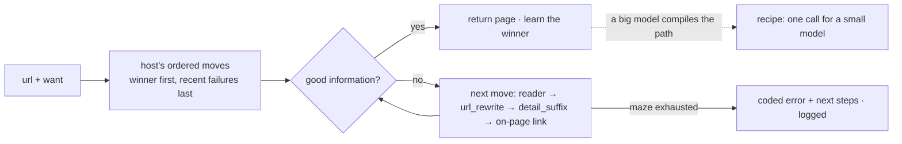

# Scout MCP

Scout is an MCP server for web crawling that improves with use. A capable model like Claude works a site out once.
Scout compiles what it learned into a **recipe** that a 4B model can run with one instruction.

```
/scout https://mikrotik.com/product/RB433AH price|cpu
```

Claude reaches the page, maps the site and finds the traps. It then hands back a one-line card that Qwen3.5-4B runs
correctly from then on:

```
Call the tool run with recipe="mikrotik.com/specs" and input="hAP ax2". Reply with the RESULT line only.

RESULT: ok | mikrotik.com/specs | hAP ax2 | url=https://mikrotik.com/product/hap_ax2; title=MikroTik · hAP ax²; price=$99.00; cpu=IPQ-6010; ram=1 GB; max_power=27 W
```

## Install

**Claude Code** (installs the MCP server and the `/scout` skill):

```
/plugin marketplace add sireggserroneous/scout-mcp
/plugin install scout@scout-mcp
```

**Any MCP client.** Install [uv](https://docs.astral.sh/uv/), then add this to the client's MCP config:

```json
{ "mcpServers": { "scout": { "command": "uvx",
  "args": ["--from", "git+https://github.com/sireggserroneous/scout-mcp", "scout-mcp"] } } }
```

**Pages built by JavaScript** need a headless browser. Add `"--with", "playwright"` to the uvx args, then run
`uvx playwright install chromium` once. If you already run Firecrawl or crawl4ai, set `FIRECRAWL_URL` or
`CRAWL4AI_URL` and Scout uses it as one more reader.

## From a maze to one line

Getting MikroTik specs looks like a one-step job. Here is what Claude actually ran into on the way:

| Try | Result |
|---|---|
| guess `mikrotik.com/product/{model}` | `RB433AH` works. `hAP ac3` is a 404: that page lives at `hap_ac3`. |
| lowercase it, turn spaces into `_` | Now `RB433AH` is a 404: that one really is uppercase. |
| also turn `+` into `plus` | `CRS354-48G-4S+2Q+RM` works (`crs354_48g_4splus2qplusrm`)… |
| | …but `RB5009UG+S+IN` lives at `rb5009ug_s_in`. Same character, opposite rule. |
| **look the url up in the sitemap, comparing both sides with `plus` and punctuation removed** | **all four styles work** |

Then the data: 4 fields, each a label on one line and its value on a later line, on a page that also has a 40-row
throughput table, a documents list and a retailer map.

Written out as instructions, that is a 7-step program with a string-normalisation rule, a loop over 566 urls,
a branch for "not found", and four lookups in a 7,000-character page. That is too much for a 4B model. So it is
never handed to one. Claude compiles it instead:

```json
{"name": "mikrotik.com/specs", "input_name": "model",
 "examples": ["RB433AH", "hAP ac3", "CRS354-48G-4S+2Q+RM", "RB5009UG+S+IN", "CCR2004-1G-12S+2XS"],
 "steps": [
  {"map": "https://mikrotik.com", "filter": "/product/", "same": [["plus", ""], ["[^a-z0-9]", ""]]},
  {"reach": "{url}", "want": "Specification"},
  {"extract": {"price":     "^\\s*-\\s*Suggested price\\s*\\n\\s*(\\S.*)$",
               "cpu":       "^\\s*-\\s*CPU\\s*\\n\\s*(\\S.*)$",
               "ram":       "^\\s*-\\s*Size of RAM\\s*\\n\\s*(\\S.*)$",
               "max_power": "^\\s*-\\s*Max power consumption\\s*\\n\\s*(\\S.*)$"}}]}
```

`compile` runs the recipe on every example and **saves it only if all of them pass**. The two wrong guesses above
were caught this way: each one passed on some examples and failed on others. Once saved, every branch lives in code.
The small model gets one card and one tool, and its whole job is a single call:

| | the small model gets | the small model must |
|---|---|---|
| without a recipe | 7 numbered steps, `site_map` and `reach` | normalise strings, scan 566 urls, branch, read a 7k-char page, format a line |
| with a recipe | 1 line, the `run` tool | make one call, copy one line |

**Measured on Qwen3.5-4B** (Q4_K_M, llama.cpp on a laptop iGPU), on 5 MikroTik models, as an A/B:

| | exact answer | tool calls | wall time (median) |
|---|---|---|---|
| **A**: the 7 steps as instructions, `site_map` + `reach` | 4 / 5 | 2–4 per model, 15 in all (5 of them wrong turns) | 389–671 s (414 s) |
| **B**: the card, `run` | **5 / 5** | **1 per model** | **22–195 s (88 s)** |

In arm A, Qwen filtered the sitemap with the raw model name, built a url with a space in it, and once dropped the `$`
from a price. It reached the right page in the end, but it took 3 to 11 minutes each time, mostly spent reading 566
urls and a 7,000-character page. In arm B the model never sees any of that. One arm-A run did catch a bug in the
recipe: the RAM regex had matched a sentence in the product description, not the spec list. The fix (anchoring each
field to its list item) went in, the recipe was recompiled with that model as a fifth example, and the arm-B run was
repeated on the fixed recipe. Both arms used the same model and the same Scout. Harness: `bench/qwen_ab.py`.

If a page changes, `run` fails loudly with a code: `NO_MATCH at step 1`, `EXTRACT_MISS at step 3`. The recipe's
score drops, and `recipes()` marks it `last run failed … recompile`. The next big-model session fixes the recipe. The
small model's card stays the same.

The CLI form fits a small model with a shell. It prints one line and exits 1 on failure:

```
$ scout-mcp run mikrotik.com/specs "CCR2004-16G-2S+"
RESULT: ok | mikrotik.com/specs | CCR2004-16G-2S+ | url=https://mikrotik.com/product/ccr2004_16g_2splus; ... price=$465.00; cpu=AL32400; ram=4 GB; max_power=48 W
$ scout-mcp run mikrotik.com/specs "nope 9"
RESULT: fail | mikrotik.com/specs | nope 9 | NO_MATCH at step 1
```

### Recipe steps

| Step | Does |
|---|---|
| `{"input": [[regex, repl], ...], "lower": true}` | rewrites the input (slug rules) |
| `{"map": url, "filter": regex, "same": [[regex, repl], ...]}` | the site's own urls. `same` keeps the url whose last segment equals the input after both are rewritten. Last step: returns the list. Otherwise: the first url becomes `{url}`. |
| `{"reach": "https://…/{input}" \| "{url}", "want": regex}` | reads a page with the full reader ladder (below) |
| `{"find": regex}` | the first link on the page whose url or text matches becomes `{url}` |
| `{"links": "/chapter/<n>/"}` | a link family from `families`. Last step: every matching link on the page. Otherwise: the first becomes `{url}`. |
| `{"extract": {"field": regex}}` | group 1 of each regex. Every field must be found. |

## How Scout learns: a maze, a Markov chain, and rewrite rules

Every way to reach a page is a **move**:
- the readers: `direct`, `firecrawl`, `crawl4ai`, `browser`
- `url_rewrite`: a regex on the full url
- `locale_prefix` × `listing_root`: where a site keeps its index of things, such as `/en-us` + `/products`
- `detail_suffix`: where the details live, such as `/specifications`

The idea comes from Markov chains and MarkovJunior-style rewrite rules. Each move takes Scout from one state to the
next. The goal state is **good information**: real content (not a wall, a login page or an error page) that carries
what you asked for.



- **Each host keeps its readers in order.** The reader that last worked goes first, and one that failed goes to the
  back for six hours. When excalidraw.com gives a plain fetch an empty JavaScript shell, Scout falls back to the
  browser. On the next visit it starts with the browser.
- **The register stores moves as data.** Each move has a scope (`*`, a domain or a host regex) and a Laplace score
  `(wins + 1) / (tries + 2)`. A move nobody has tried scores 0.5. A move that loses its first five tries is retired.
  Agents propose moves with `moves(action='propose', …)`, and real traffic decides which ones stay.
- **Parts compose.** A listing url is a locale prefix (`""`, `/en-us`, `/us/en`, …) plus a catalogue root
  (`/products`, `/collections`, `/catalog`, …). Scout ranks every pairing by the product of the two parts' scores. It
  puts the locale in the url you gave it, or the one the host taught it, first. Credit is by contrast: when
  `/products` wins after `/en/products` failed, only `/en` loses. When nothing wins, nothing is scored, because a
  site with no listing teaches nothing about the parts.
- **Recipes are the compiled layer on top.** Every run scores a recipe, the same way moves are scored.

### The recipe book it ships with

`scout_mcp/recipes.json` was distilled from 417 sites that a larger crawler had learned. Every one was checked live
again on 2026-10-03 with Scout's own user agent, and only what held up was kept:

- **Shared structure became scored parts.** The priors are measured. `/products` was the root of all 13 verified
  catalogue indexes. A bare root (no locale) won 8 of 8. The `/en` prefix the old crawler kept guessing was real on
  only 4 of 41 sites: the rest were 404s, homepage redirects, or soft 200s serving the homepage. `/specifications` is
  the detail page on 5 sites.
- **Per-site facts, only where a site differs** (147 sites): 56 need a rendering reader, 14 have a verified listing
  (7 with a locale), 28 have item url patterns proven by a real catalogue, 6 have a detail suffix, and 59 put up a
  wall (challenge, robots, refusal or login) that Scout reports before trying.
- **Dropped:** unverified listings, including product pages, category pages, tag pages and a census.gov policy page
  that had all passed as "listings", plus item patterns a small model guessed but a catalogue never proved.

Point `SCOUT_DB` at a shared path and a whole team, people and agents alike, learns from each other's runs.

## Link families: walking a site with no sitemap

These rules came from a sibling project: a recipe chain that rebuilt 16 US state codes from scratch, with 7 or 8 of
every 8 sampled sections matching the held text word for word. Its hardest problems were about links, and the fixes
were all general:

- **A link's family is its path with the numbers taken out.** `Chapter_1.html` and `Chapter_14A.html` are one family,
  and so are `NHTOC-I.htm` and `NHTOC-XIV.htm` (Roman numerals). Links with no numbers group as siblings under their
  parent (`/products/*`). Only same-site families with 3 or more links count. Static assets, `#anchors` (each item is
  read once, not once per anchor) and a page's link to itself are ignored.
- **Sample across the family, not its first links.** A list opens with its odd items: a code's first chapter is often
  a one-line "Repealed". Requiring 2 of 3 good samples at every level compounded into no path at all, so it is 2 at
  the top and 1 below.
- **Vote on what the family leads to, not on whichever sample came back first.** Section pages that also list their
  neighbours made one sample look like an index; the majority got it right.
- **Look deeper before trusting a weak match.** A page that looks like one item, but still has families leading down,
  is walked further first.
- **Rank by yield through every level:** links × share of good samples × what each yields below. Scoring one level at a
  time made a five-page index outrank 89 chapters of sections.
- **Tell content from menus by function words.** The density of *the, of, shall, any* separates sentences (≈0.35–0.5)
  from navigation (≈0.15) where capitals and length could not. Every `reach` result carries this `prose` score.
- **Skip families that lead to a different kind of document.** Statute pages link to the bills that enacted them, and
  the chain followed them into scanned slip laws.

`families(url, want?)` runs this walk and returns the ranked families, their samples, and a `recipe_hint` draft for
`compile`. The `links` recipe step then lists a family's urls on sites with no sitemap.

Live, on two sites (2026-10-03):

| Start | Best chain found by sampling | Estimate | Compiled hint |
|---|---|---|---|
| Idaho statutes index | `Title<n>` (74 links, 5/5 samples are indexes) → `Title<n>/T<n>` (34 per title, 3/3 pages) | ≈2,516 chapter pages | `RESULT: ok … count=19; first=…/Title1/T1CH1` |
| a MikroTik category page | `/product/*` (22 links, 5/5 pages) | 22 products | `RESULT: ok … count=22; first=…/product/hex_s_2025` |

MikroTik added two rules the law sites never needed:
- **A family the page above already shows is navigation.** Every MikroTik page carries the same category menu, and
  without this rule the walk descended from the menu back into the menu.
- **Siblings group under their parent first.** The number shape names the family only when one shape covers 80% of
  them (`Title<n>`). `RB<n>` and `crs<n>_<n>_<n>_in` are both just `/product/*`.

## When a site blocks you

Also from the sibling project. A statute site blocked its crawler's address after a re-read at ten requests a second,
and the lessons generalise:

- **A block page can come back as HTTP 200.** That site answered `Blocked <your IP> … for assistance EMAIL:
  WebMaster@…` as an ordinary page, so a check on status codes alone never saw it and the crawler kept going. Scout
  reads a page as a block only when it has **both halves**, a refusal ("blocked", "access denied", "too many
  requests") and something about the visitor (an IP address, "your IP", a CAPTCHA, "are you a robot"). That way a page
  that only mentions "blocked" isn't mistaken for one. It checks error bodies and 200 pages alike.
- **A block stops the whole walk.** Every reader leaves from the same address, so trying the next one only adds to
  the load. Scout stops, puts the host **on hold** for 30 minutes, and slows its pace there for good (5 s or slower).
  A 429 does the same, for its `Retry-After` or 2 minutes.
- **The probe is built in.** When an automatic hold ends, the next reach is a single probe. If it is refused again,
  the hold doubles (up to a day) and the pace slows again. You don't need a separate watcher process.
- **Holds are shared.** They live in Scout's memory, so every agent pointed at the same `SCOUT_DB` stays off the site.
  A held host is not contacted at all: `reach`, `site_map` and `families` return `HELD` and send no request.
- **The way out is a person.** The block page usually names a contact, and Scout keeps it with the host. The
  `BLOCKED` error's first next step says who to email and what to say: what reads the site, that it went too fast,
  the new pace, and an offer to use a bulk download. `hold(host, reason='unblock requested <date>')` then keeps
  everyone off until `hold(host, lift=true)`. A hold set that way has no end date, so Scout never probes it.

## Official routes and enrollment

When a site walls Scout, the best next step is usually the site's own front door: an open API, a bulk download, a
feed, or an API a person signs up for. Scout keeps that per site as its **access** entry.

- **No signup needed** (`open_api`, `bulk`, `feed`, `public_json`, `alternative`): the wall's first next step is that
  route, as a ready `reach(...)`.
- **A person must enroll** (`enroll_free`, `enroll_paid`, `enroll_oauth`, `commercial`): Scout files an **enrollment
  request** the first time the wall is hit. `enroll(action='list')` is the checklist. Each entry says where to sign
  up, what it costs, the terms, and where the key goes.
- **No route known yet:** the error says so, and a big model looks for one (the API, developer program or bulk
  download) and records it with `enroll(action='request', …)`. Say you need LexisNexis but haven't set Scout up for
  it: `/scout https://www.lexisnexis.com/...` hits the login, Claude records LexisNexis's developer program, and it
  lands on the checklist.
- **Updating Scout:** `/scout-update` works through the checklist with you, along with failing recipes, holds waiting
  on a site's answer, and recent failures. When you've put a key in place, `enroll(action='done')` tests it on the
  API's sample url before marking the site enrolled. From then on recipes call the API with no key in them; Scout adds
  it.

**Keys never pass through a tool.** They live in `SCOUT_KEY_<NAME>` environment variables or in
`~/.config/scout-mcp/keys.env` (`NAME=value`). Scout ignores that file unless its mode is 600. A key is added at fetch
time, only to its own API's host, and scrubbed by value from every page, url and error Scout returns. OAuth client
credentials (`NAME_ID` and `NAME_SECRET`) are exchanged for a token, which is cached until it expires.

The book ships with the official routes for 21 sites that challenged Scout, researched and tested on 2026-10-03:

| Site | Official route | Signup | Tested from a datacenter address |
|---|---|---|---|
| www.ecfr.gov, ecfr.federalregister.gov | eCFR API (+ GovInfo bulk XML) | none | 200 JSON, while the pages challenge |
| www.drugs.com | DailyMed, openFDA and RxNav (the FDA's own label data) | none | 200 JSON |
| www.nytimes.com | RSS feeds (full text needs the free Developer API key) | none | 200 RSS |
| www.arlingtonma.gov | the town's RSS feeds and GIS data hub | none | 200 RSS, 200 JSON |
| snuggymom.com | WordPress RSS and REST API | none | 200 JSON |
| www.dmp.com | product literature on assets.dmp.com | none | 200 PDF |
| alaskacountyoffices.org | Alaska's state community database (ArcGIS) | none | 200 JSON |
| legiscan.com | LegiScan Public API | free key | — |
| www.merriam-webster.com | Merriam-Webster Dictionary API | free key (non-commercial) | — |
| www.britannica.com | Britannica Syndication API | free key (non-commercial) | — |
| www.digikey.com | DigiKey Product Information v4 | free OAuth app | — |
| www.bhphotovideo.com, www.guitarcenter.com | affiliate programs (product feeds unverified) | free application | — |
| us.rs-online.com, www.acronymfinder.com | licensed web services | contract | — |
| webfiles.nycourts.gov, dictionary.cambridge.org, www.arcat.com, www.essentialbuildstore.com, aqcheckin.s3.amazonaws.com | none found: no API, a retired one, an unreachable one, or a private bucket | — | the reason is recorded, so no one searches again |

Several "challenged" sites serve their own APIs and feeds without any challenge. A wall in front of the pages is
often not a wall in front of the data.

## Lessons from a big catalogue: AMD

The sibling crawler's scout went after AMD's catalogue, and every mistake it made became a general rule:

- **A wall can be silent.** From some networks amd.com answers no status at all: the plain fetch stalls until it
  times out, and the browser's HTTP/2 stream is reset. Scout used to call that `NETWORK` and suggest checking the
  spelling. A stall or reset from a host that resolves is now `SILENT_REFUSAL`: the site's edge refusing this client.
  It is treated as a wall (official route first, the host held so nothing keeps knocking), not as a typo.
- **A map has to work when plain fetches don't.** `site_map` reads sitemaps and walks links through the host's learned
  reader, not just a plain fetch.
- **Map from the catalogue's root when nothing else looks like a catalogue.** AMD's map ran out on blog posts. Walking
  `/en/products` found 1,561 product pages. When the sitemap and the walk turn up no catalogue-shaped urls, Scout finds
  the root with its scored locale × root parts and walks from there. That way the step is a scored move, not a
  hard-wired rule.
- **Editorial sections are never the items.** The scout picked `/blogs/` and `/newsroom/` as AMD's product pattern and
  "proved" 689 blog posts. Blog, news, press, events, careers, investors and similar patterns are flagged `editorial`
  and ranked last in `site_map` and `families`.
- **A title of `=====` is not a title.** It falls back to the page's first real heading.
- **"… Series" is a category.** So are "… Family" and "… Lineup". Recipes pick their examples from single items.
- **A page with children under its own path is a hub, not an item.** `families` counts 3 or more child pages as an
  index. Partner, request-a-quote and contact pages are flagged with the editorial ones. Support pages are not flagged,
  because some makers keep their product pages under `/support/`.
- **Listing a whole site again and again gets you blocked.** Four dry runs in an hour, each re-listing amd.com, and its
  edge answered "Access Denied" to everything. `site_map` now reuses a host's listing for 12 hours (`fresh=true` to
  list again). The edge's denial page names no IP, only an incident reference (`Reference #18.…`). An incident
  reference (Akamai Reference #, Cloudflare Ray ID) now counts as the visitor half of a block, so the host is held,
  not retried.

## Errors that say what to do next

When Scout fails, it returns an error `code`, a `message`, and `next_steps` written as concrete tool calls, plus the
`tried` trail it took through the maze. Any capable model can pick up from there.

| Code | Next steps point to |
|---|---|
| `NOT_FOUND` | `site_map` instead of guessing paths |
| `WANT_MISS` | loosening `want`, a `detail_suffix` move, `site_map` |
| `JS_SHELL` / `THIN_CONTENT` | adding a rendering reader, the site's JSON endpoints, a print view |
| `REFUSED` / `SILENT_REFUSAL` / `CHALLENGE_WALL` / `LOGIN_REQUIRED` | the site's official route, its partner program, the same information published elsewhere |
| `BLOCKED` / `HELD` | who to email to lift the block, `hold` to keep every agent off until they answer, when Scout probes |
| `ROBOTS_DISALLOWED` / `RATE_LIMITED` | an official feed, waiting for `Retry-After` |
| `TLS_ERROR` / `NETWORK` / `SERVER_ERROR` | the cause, retrying later |
| `NO_URLS` / `NO_LISTING` / `NO_MATCH` / `EXTRACT_MISS` / `TEST_FAILED` | what to recompile or propose |

## Tools

| Tool | For | Does |
|---|---|---|
| `scout(url, want?)` | big model | reaches the page, maps url patterns, finds the listing, reports what was learned |
| `reach(url, want?, full?)` | big model | reads one page through the learned ladder |
| `site_map(url, filter?)` | big model | the site's own urls and their patterns |
| `families(url, want?, depth?)` | big model | which link families lead to good pages, by sampling and vote |
| `compile(name, steps, examples, …)` | big model | tests a recipe and saves it, returns the small-model card |
| `moves(action, …)` | big model | lists, proposes or retires moves |
| `hold(host, reason?, lift?, min_interval?)` | big model | keeps every agent off a site (or lets them back), slows Scout's pace there |
| `enroll(action, host?, info?, note?)` | big model | records a site's official route, and lists, tests and closes enrollment requests |
| `memory(host?)` | big model | reader order, routes, moves and recent failures for a host |
| `recipes(host?)` | both | compiled recipes with scores, status and cards |
| `run(recipe, input?)` | **small model** | runs a recipe, returns one RESULT line |

Give the small model only `run`, or the CLI. One tool means it has nothing to choose between.

## Configuration

| Variable | Default |
|---|---|
| `SCOUT_DB` | `~/.local/share/scout-mcp/scout.db` |
| `SCOUT_USER_AGENT` | `ScoutMCP/<version> (+https://github.com/sireggserroneous/scout-mcp)` |
| `SCOUT_MIN_INTERVAL` | `1.0` seconds between requests to one host |
| `SCOUT_KEYS_FILE` | `~/.config/scout-mcp/keys.env` (mode 600), next to `SCOUT_KEY_<NAME>` env vars |
| `FIRECRAWL_URL`, `FIRECRAWL_API_KEY`, `CRAWL4AI_URL`, `CRAWL4AI_TOKEN` | unset |

## Develop

```
uv venv && uv pip install -e . playwright
python -m scout_mcp.scout      # self-checks, no network
```

There are two modules. `scout_mcp/scout.py` is the engine, and `scout_mcp/server.py` holds the MCP tools and the CLI.
Seed moves and example recipes are in `scout_mcp/recipes.json`. MIT licensed.
